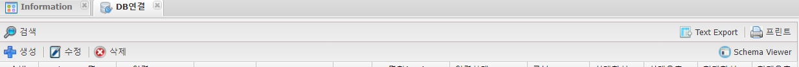
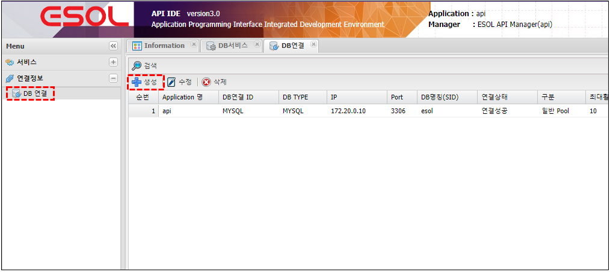
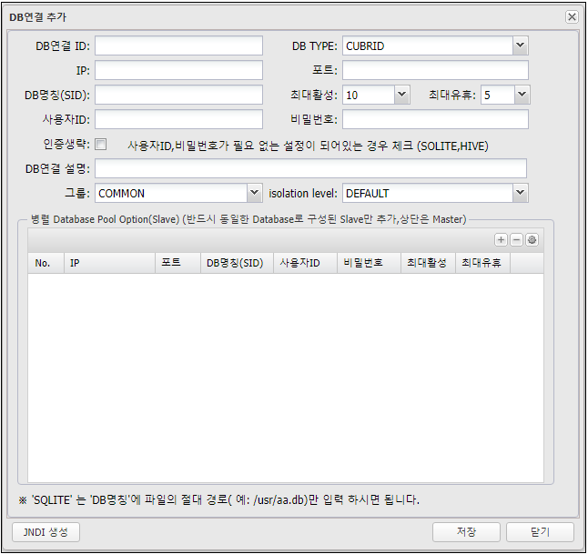
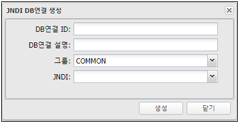
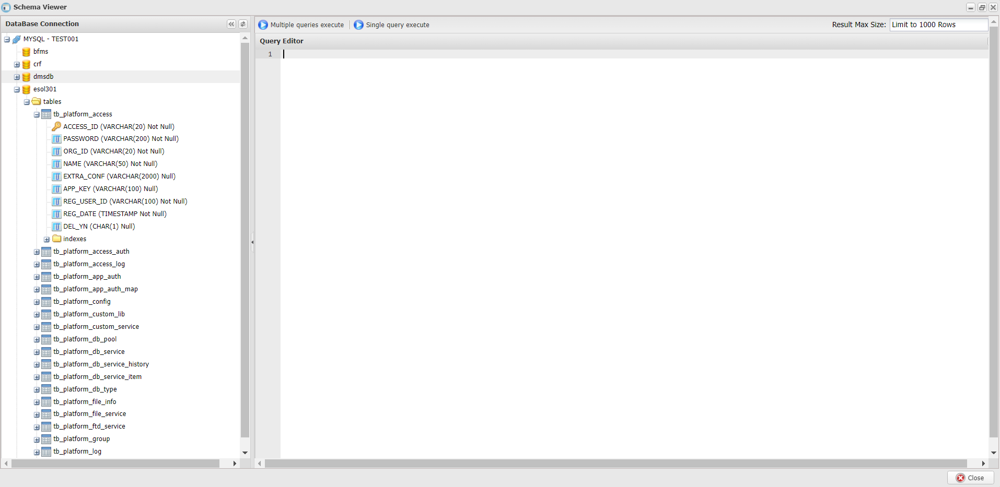

# DB 연결

---
## 1. DB 연결 이란
### 1.1. 정의

>DB Service에서 사용 될 DBMS 연결 정보 생성

### 1.2. 지원하는 DBMS
- MYSQL
- MARIADB
- MSSQL
- ORACLE
- TIBERO
- CUBRID
- POSTGRESQL
- PRESTO
- SQLITE

### 1.3. 주요기능 및 부가기능
 </img>
| 기능 | 설명 |  
|:--:|:--|  
| 검색  | 전체 DB연결 정보를 조회 |
| Text Export  | 조회된 화면(목록)을 Text 로 Export |
| 프린트  | 조회된 화면(목록) 인쇄 |
| 생성  | DB연결 생성 |
| 수정  | 조회된 화면(목록)에서 선택된 DB연결 수정 |
| 삭제  | 조회된 화면(목록)에서 선택된 DB연결 삭제 |
| Schema Viewer  | 선택된 DB연결로 Database의 Schema를  간단하게 확인 할 수 있는 기능 단. Database Vender에서 제공하는 Tool를 사용할 것을 권장   |

## 2. 사용법
### 2.1. 생성

🎈 __Menu > 연결정보 > DB 연결 > 생성__  

 </img>

### 2.2. 속성

 </img>

| 입력값 | 설명 |
|:--:|:--|
| DB 연결 ID | 고유식별자, DB Service등에서 DB 연결 ID 선택 시 사용 중복불가능, 20자 이내, 영어숫자 underscore(_)사용 가능 |
| DB TYPE | 연결할 대상의 DBMS선택 |
| IP | 연결할 DBMS의 IP, HOST |
| 포트 | 연결할 DBMS가 사용중인 Port(숫자) |
| DB명칭(SID) | MSSQL, MySQL, MariaDB 에서는 Database명, ORACLE sid |
| 최대활성 | Connection Pool 갯수 |
| 최대유휴 | Connection Pool 안의 유휴 갯수 설정 |
| 사용자 ID | Database 연결시 사용되는 사용자 ID |
| 비밀번호 | Database 연결시 사용되는 사용자의 비밀번호 |
| 인증생략 | 사용자 인증이 필요없는 DBMS인 경우 체크 예)SQLITE |
| 그룹 | 작업자가 구분하기 위해서 사용 (Menu > 관리도구 > 서비스 그룹 에서 생성가능) |
| isolation level | dafault transaction isolation level을 의미 |
| 병렬  Database Pool Options(Slave) | slave로 구성된 database 정보 기입란(복수개 입력가능) |

#### 2.2.1. SQLite 접속 방법
| 입력값 | 설명 |
|:--:|:--|
| IP |  127.0.0.1 입력 (7자이상 숫자 아무거나 기입 가능) |
| PORT |  1 입력(1자리 이상 숫자 아무거나 기입 가능) |
| DB명칭(SID) |  sqlite db file path ex) /home/user/data/sqlite.db |
| 사용자ID |  1자리 이상 영문, 숫자, _ 아무거나 입력가능 ( 공백도 가능 ) |
| 비밀번호 |  1자리 이상 영문, 숫자, _ 아무거나 입력가능 ( 공백도 가능 ) |

### 2.3. JNDI 생성 방법

 </img>

| 입력값 | 설명 |
|:--:|:--|
| DB연결 ID| 연결하는 ID 정보 기입 |
| DB연결 설명| DB 정보 기입 |
| 그룹| DB서비스에 연결할 그룹ID 선택  |
| JNDI| 연결할 JNDI 선택 |

### 2.4. Schema Viewer

 </img>

목록에 선택된 DB연결(연결상태가 연결성공인 경우)의 Schema를 확인 할 수 있습니다. 
단. Schema가 복잡하고 많은 경우 화면이 팝업되는게 느려질수 있습니다.
 
일반적인 Database Tool(Workbench, DBeaver등) 사용을 권장 
