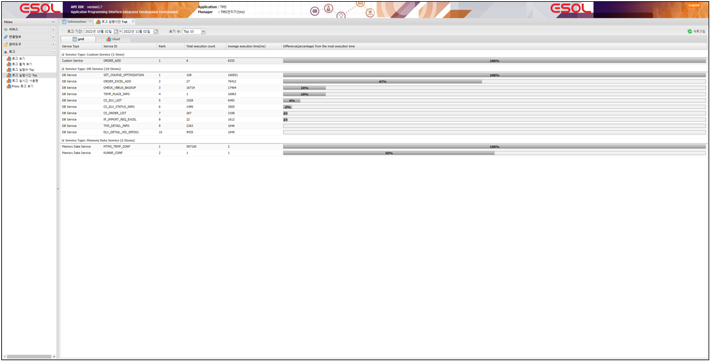
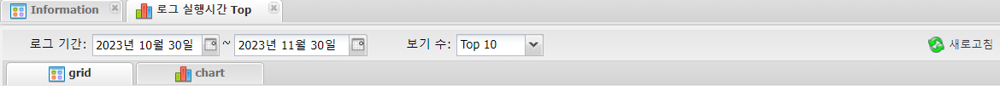

# 로그

---

## 1. 로그 실행시간 Top
서비스의 평균실행시간이 높은 순서로 보는 기능으로
비정상적일 수 있는 서비스를 확인하는데 사용한다.
 </img>

### 1.1. 주요기능 및 부가기능
 </img>
| 기능 | 설명 |  
|:--:|:--|  
| 새로고침  | 새로고침 기능 :  조건은 기간 , 보기 수    |
| grid  | 평균실행시간 높은 서비스를 grid 형태로 보여주는 탭 |
| chart  | 평균실행시간 높은 서비스를 chart 형태로 보여주는 탭 |