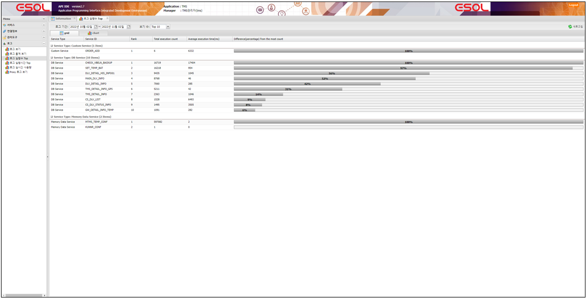
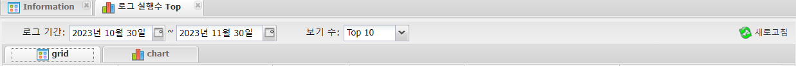

# 로그

---

## 1. 로그 실행수 Top
서비스의 실행 횟수가 많은 서비스를 보는 화면
 </img>

### 1.1. 주요기능 및 부가기능
 </img>
| 기능 | 설명 |  
|:--:|:--|  
| 새로고침  | 새로고침 기능 :  조건은 기간 , 보기 수    |
| grid  | 실행 횟수가 많은 서비스를 grid 형태로 보여주는 탭 |
| chart  | 실행 횟수가 많은 서비스를 chart 형태로 보여주는 탭 |