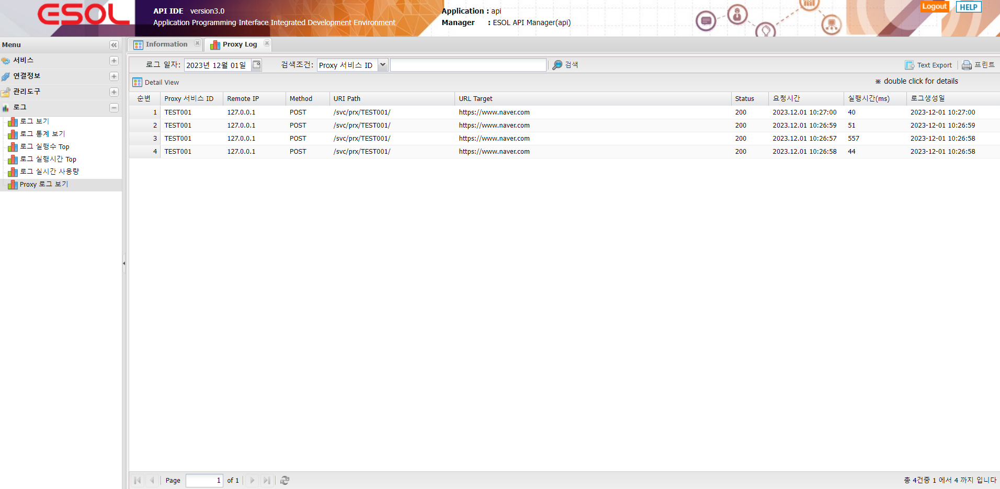
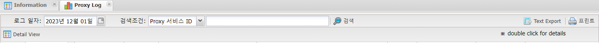
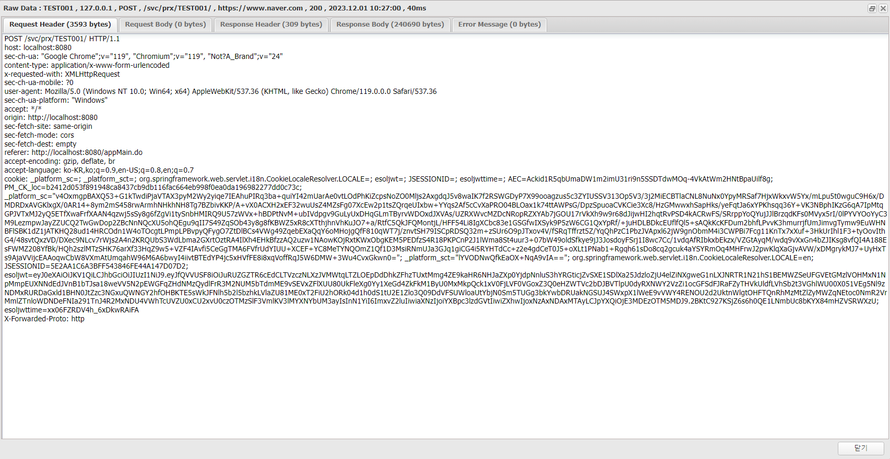

# 로그

---

## 1. Proxy 로그 보기
Proxy 서비스에 대한 로그 및 결과값을 보여주는 화면
 
단. Proxy 서비스 생성시 "로그 (DB Insert)" 항목이 "사용"으로 설정된 서비스만 로그 및 결과값이 저장 됩니다.
 </img>

### 1.1. 주요기능 및 부가기능
 </img>
| 기능 | 설명 |  
|:--:|:--|  
| 검색  | 서비스 로그 검색 기능 :  검색조건은 로그일자 , 서비스ID , Method , Status ,  URI Path , URL Target 으로 검색|
| Text Export  | 조회된 화면(목록)을 Text 로 Export |
| 프린트  | 조회된 화면(목록) 인쇄 |
| Detail View  | 결과값 보여주는 화면 Request Header , Request Body ,  Response Header , Response Body ,  Error Message |

### 1.2. Detail View

Request Header , Request Body , Response Header , Response Body ,  Error Message 탭에서 상세정보를 확인 할 수 있습니다.
 
 </img>
