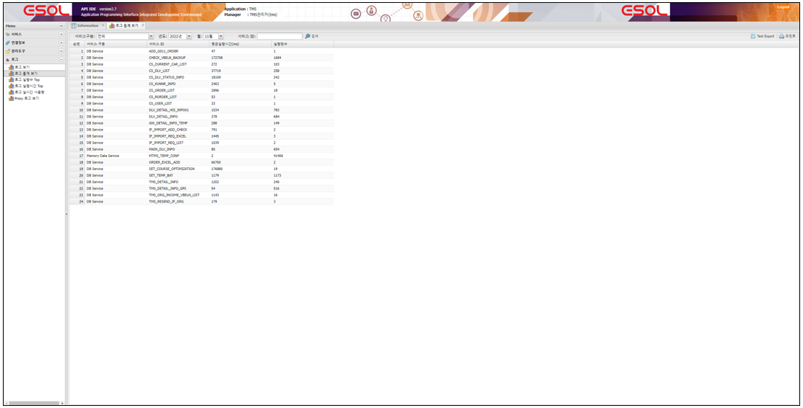
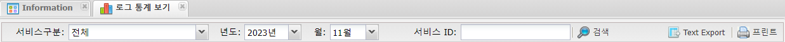

# 로그

---

## 1. 로그 통계 보기
서비스의 실행로그의 월별 통계(평균실행시간 , 실행횟수)
 </img>

### 1.1. 주요기능 및 부가기능
 </img>
| 기능 | 설명 |  
|:--:|:--|  
| 검색  | 검색 기능 :  검색조건은 서비스구분,월별 ,  서비스ID로 검색 |
| Text Export  | 조회된 화면(목록)을 Text 로 Export |
| 프린트  | 조회된 화면(목록) 인쇄 |
