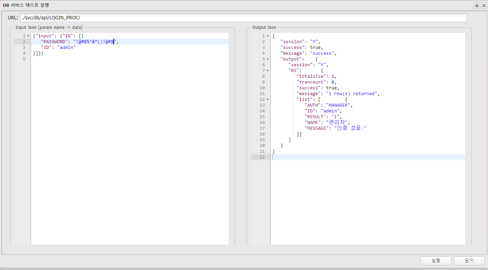
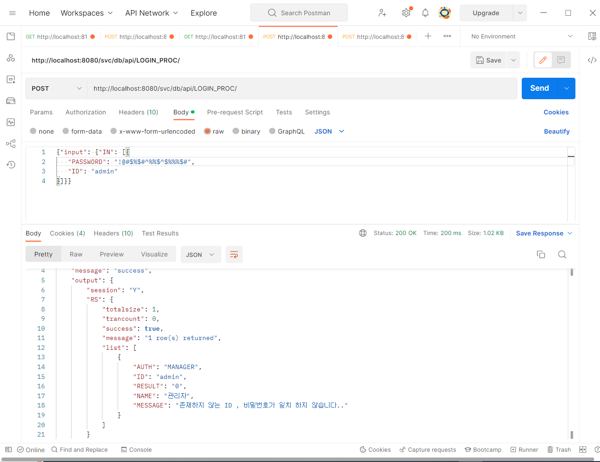

# 접속(인증) 관리
---

## 1. 접속(인증) 관리란
### 1.1. 정의

>서비스 중 인증체크를 사용 하는 서비스에 접근이 가능하게 인증 TOKEN을 발급

### 1.2. 접속 방식

- Keycloak 인증설정 (권장)
- 접속계정관리
- ESA 설정
- SQL 인증
- 사용자정의 ESOL 인증 (설치 버전의 경우에 한함)

## 2. 사용법
### 2.1. Keycloak 인증 설정

 </img>

| 구분 | 설명 |
|:--:|:--|
| Keycloak | 사용유무 설정 |
| host | Keycloak Host `ex)http://100.0.0.1:8080` |
| realm | Keycloak Realm |
| client_id | Keycloak Client ID |
| client_secret | Keycloak Client secret |
| config url | `ex)http://100.0.0.1:8080/auth/realms/esol_grp/.well-known/openid-configuration`|
| 'config url check' | config url을 설정한 경우 해당 버튼을 클릭하면 하위 endpoint 정보를 받아옴 |
| authorization endpoint | `ex)http://100.0.0.1:8080/auth/realms/esol_grp/protocol/openid-connect/auth` |
| token endpoint | `ex)http://100.0.0.1:8080/auth/realms/esol_grp/protocol/openid-connect/token` |
| user info endpoint | `ex)http://100.0.0.1:8080/auth/realms/esol_grp/protocol/openid-connect/userinfo`<br/> ESOL에서 Access Token을 검증하고 사용자 정보를 얻어오는 end point |
| end session endpoint | `ex)http://100.0.0.1:8080/auth/realms/esol_grp/protocol/openid-connect/logout` |
| introspection endpoint | `ex)http://100.0.0.1:8080/auth/realms/esol_grp/protocol/openid-connect/token/introspect` |
| Key to use in user info | user info endpoint에서 받은 사용자 정보 중 ESOL 인증 TOKEN에서 사용할 Key, Value를 맵핑하는 정보 |

#### 2.1.1 Keycloak 인증 속성

>__Service 호출 시__  
>Request Header에 Authorization:Bearer {ACCESS_TOKEN} 입력 하여 호출

> __Keycloak의 user 정보를 ESOL의 TOKEN에 맵핑 예__  
> user info에 username, private.info.phone을 ESOL TOKEN에 USER_NAME, USER_PHONE

 </img>

```
keycloak의 user 정보  예)

{
	“client_id” : “api”
,	.
,	.
,	.
,	“username” : “test@gmail.com”
,	“private” : {
           “info” : {
              “phone” : “01000001111”
           }
     }
};
```

⬇

```
ESOL TOKEN 예)

{
	“USER_NAME” : “test@gmail.com”
,	“USER_PHONE” :  “01000001111”
}
```

- DB Service 에서 세션변수로 사용

```sql         
SELECT   ID
,        {‘$USER_PHONE$’} AS PHONE
FROM    테이블
WHERE   USER_NAME = {‘$USER_NAME$’}
;
```

### 2.2. DB Service Auth
#### DB Service 를 이용한 인증 처리

DB Service의 SQL 과 제공되는 javascript 함수 , 그리고 java method call 을 이용하여 기존 사용자 테이블의 정보를 이용하여 ESOL 인증를 처리 한다.

1. 사용자 ID , Password (sha256)  컬럼이 포함된 사용자 테이블(Legacy Table)이 존재해야 한다.

2. 인증처리용 DB Service를 생성한다.   
    반드시 인증체크는 **미사용** 이어야 한다.
    
3. 사용자 테이블의 정보를 조회 후  javascript 를 이용하여 인증처리여부를 확인 하고 원하는 조건에 해당 하는 경우 제공된 인증함수( login(Map) ) 를 실행한다.


<br/><br/><br/>


#### Example

1. 사용자 테이블 (Sample)
<pre><code>
-- 사용자 정보 테이블
CREATE TABLE tb_user_info (
  ID varchar(20) COLLATE utf8mb4_unicode_ci NOT NULL,
  PASSWD varchar(500) COLLATE utf8mb4_unicode_ci NOT NULL,
  NAME varchar(100) COLLATE utf8mb4_unicode_ci DEFAULT NULL,
  AUTH varchar(20) COLLATE utf8mb4_unicode_ci NOT NULL,
  CREATED_DT datetime DEFAULT CURRENT_TIMESTAMP,
  UPDATED_DT datetime DEFAULT CURRENT_TIMESTAMP,
  PRIMARY KEY (ID)
) ENGINE=InnoDB DEFAULT CHARSET=utf8mb4 COLLATE=utf8mb4_unicode_ci;


-- 인증처리 결과 히스토리 테이블
CREATE TABLE tb_user_auth_history (
  ID varchar(20) COLLATE utf8mb4_unicode_ci NOT NULL,
  STATUS varchar(20) COLLATE utf8mb4_unicode_ci NOT NULL COMMENT '로그인 결과 : 0=성공 , 1=ID 없음 , 2=암호가 일치하지 않음',
  USER_AGENT varchar(200) COLLATE utf8mb4_unicode_ci DEFAULT NULL,
  REMOTE_IP varchar(100) COLLATE utf8mb4_unicode_ci DEFAULT NULL,
  CREATED_DT datetime DEFAULT CURRENT_TIMESTAMP,
  UPDATED_DT datetime DEFAULT CURRENT_TIMESTAMP
) ENGINE=InnoDB DEFAULT CHARSET=utf8mb4 COLLATE=utf8mb4_unicode_ci;

</code></pre>
<br/><br/><br/>

2. 인증 처리용 DB Service 생성
    
    DB Service ID : LOGIN_PROC

     </img>

    주의 인증체크 : 미사용

<br/><br/><br/>

3. 조회 쿼리 생성

    사용자 정보 조회 및 ID , 암호 체크 쿼리
     </img>
    <pre><code>
    /* 1. 사용자 정보 조회  (ID , PASSWORD 입력)  */

    SELECT  A.ID
    ,       A.NAME
    ,       A.AUTH
    ,       CASE    WHEN A.PASSWD = {'#@com.evan.platform.util.EvanEnc@sha256(PASSWORD)#'} THEN '1'
                    ELSE '0'
            END AS RESULT
    FROM    TB_USER_INFO A
    WHERE   1=1
    AND     A.ID    = {'#ID#'}
    /*
    AND     A.AUTH  IN ('USER','MANAGER')
    */

    </code></pre>

<br/><br/><br/>

4. 인증체크,인증생성, 인증처리결과 히스토리 입력 쿼리 생성

     </img>
    <pre><code>

    /* 2. 정보 확인 및 로그인 처리 , 히스토리 생성*/
    <!
            /* 정보 얻기 */
            /* ID에 대한 정보가 있는지 확인 */
            if(_outputJson.getJSONObject("RS").getInt("totalsize")==0){
                    data.RESULT="2";
                    /* 대상자체가 없어서 임의로 만들어 준다. */
                    var _list = new (Java.type('net.sf.json.JSONArray'));
                    var _jobj = new (Java.type('net.sf.json.JSONObject'));
                    _jobj.put("RESULT","2");
                    _jobj.put("MESSAGE","존재하지 않는 ID , 비밀번호가 일치 하지 않습니다.");
                    _list.add(_jobj);
                    _outputJson.getJSONObject("RS").put("list",_list);
            }else{
                    var loginInfo = _outputJson.getJSONObject("RS").getJSONArray("list").getJSONObject(0);
                    /* 암호 일치 */
                    if(loginInfo.RESULT=='1'){
                            /* 세션변수에 필요한 정보만 넣는다 */
                            var mapAuth = {
                                ID :  loginInfo.ID ,
                                NAME :  loginInfo.NAME ,
                                AUTH :  loginInfo.AUTH
                            };
                            print(JSON.stringify(mapAuth));
                            /* ESOL 관리자가 테스트하는 경우는 인증 처리를 하지 않는다. */
                            if(_session.ORG_TYPE==undefined){
                                    login(mapAuth); /* ESOL 인증 처리*/
                            }
                            loginInfo.put("MESSAGE","인증 성공.");
                    }else{
                            loginInfo.put("MESSAGE","존재하지 않는 ID , 비밀번호가 일치 하지 않습니다..");
                    }
                    data.RESULT = loginInfo.RESULT;
                    /* 출력되면 안되는 정보 삭제 (password , 민감한정보 등) */
                    /* loginInfo.remove("PASSWD"); */
            }
            var PlatFormUtil = Java.type('com.evan.platform.common.PlatFormUtil');
            data.USER_AGENT = PlatFormUtil.getUserAgent(_request);
            data.REMOTE_IP = PlatFormUtil.getIpAddr(_request);
            updateJsonObject(data);
    !>

    /* 로그인 히스토리를 생성한다. */

    INSERT INTO TB_USER_AUTH_HISTORY(ID,STATUS,USER_AGENT,REMOTE_IP)
    VALUES({'#ID#'} , {'#RESULT#'} , {'#USER_AGENT#'} , {'#REMOTE_IP#'})


    </code></pre>


<br/><br/><br/>

5. DB Service 
    

     </img>

6. 테스트
    
    인증 성공

     </img>

    인증 실패

     </img>

    

<br/><br/><br/>

7. Postman Test
    
    인증 성공

     </img>
    <br/>
    <br/>
    <br/>
    인증 실패

     </img>


   


```
