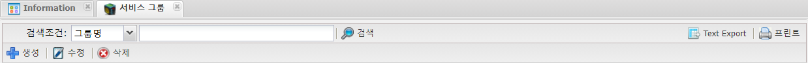
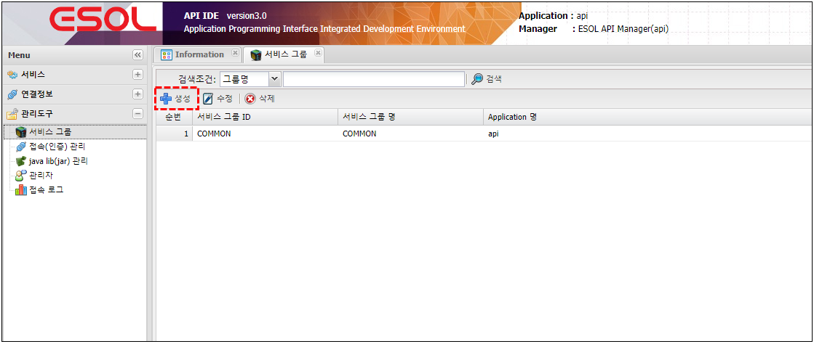
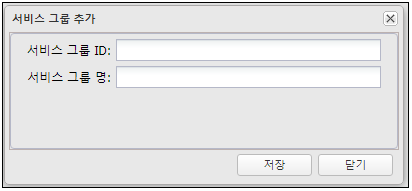

# 서비스 그룹 

---

## 1. 서비스 그룹이란
### 1.1. 정의

>서비스를 그룹 단위로 관리 , 조회 및 구분을 용이하게 한다.
  
 일반적으로 서비스의 성격이나 업무단위로 구분 하여 관리한다.
  
  
 예)
  
  COMMON : 공통서비스 
  ORDER  : 주문관련 서비스 
  PAY : 결제관련 서비스

### 1.2. 주요기능 및 부가기능
 </img>
| 기능 | 설명 |  
|:--:|:--|  
| 검색  | 검색 기능 :  검색조건은 그룹ID ,  그룹명으로 검색 |
| Text Export  | 조회된 화면(목록)을 Text 로 Export |
| 프린트  | 조회된 화면(목록) 인쇄 |
| 생성  | 그룹 생성 |
| 수정  | 조회된 화면(목록)에서 선택된 그룹 수정 |
| 삭제  | 조회된 화면(목록)에서 선택된 그룹 삭제 |

## 2. 사용법
### 2.1. 생성

🎈 __Menu > 관리도구 > 서비스그룹 > 생성__

 </img>

### 2.2. 속성

 </img>

| 구분 | 설명 |
|:--:|:--|
| 서비스 그룹 ID | 25자 이내 영문,숫자,특수문자('_') |
| 서비스 그룹 명 | 작업자가 구분하기 위해 사용 |
