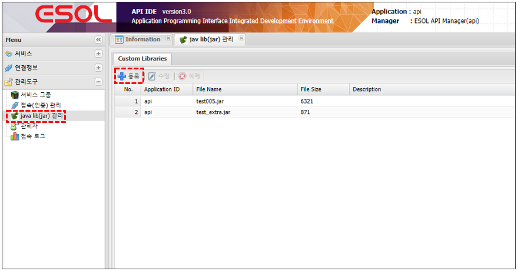
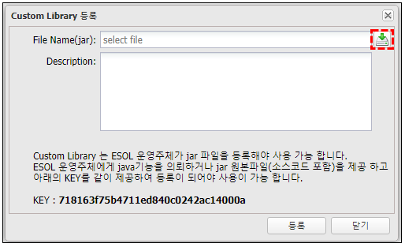
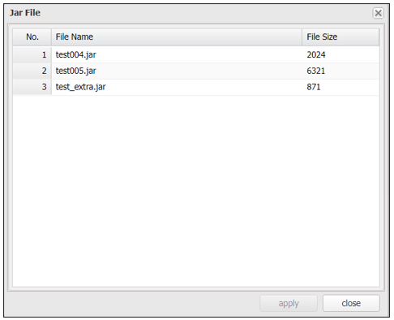

# java lib(jar) 관리

---

## 1. java lib(jar) 관리란
### 1.1. 정의

>DB Service에서 java method 호출 가능한 custom java lib(jar)을 관리 하는 기능,  
>사용자가 직접 jar 파일을 등록 할 수 없다,  
>ESOL 운영주체만 jar 파일을 등록 할 수 있으며 등록된 jar 파일만 관리 

### 1.2. 주요기능 및 부가기능
 </img>
| 기능 | 설명 |  
|:--:|:--|  
| 등록  | Jar library 등록 |
| 수정  | 조회된 화면(목록)에서 선택된 Jar library 수정 |
| 삭제  | 조회된 화면(목록)에서 선택된 Jar library 삭제 |

## 2. 사용법
### 2.1. 등록

🎈 __Menu > 관리도구 > java lib(jar) > 등록__

 </img>

 </img>

 </img>
