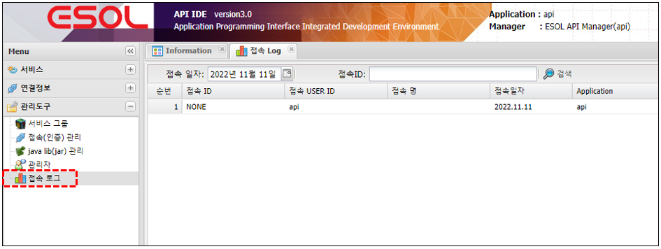

# 접속 Log

---

## 1. 접속 Log란
### 1.1. 정의

>접속한 USER ID 접속 목록 출력

 </img> 

### 1.2. 주요기능 및 부가기능

| 기능 | 설명 |  
|:--:|:--|  
| 검색  | 검색 기능 :  검색조건은 접속일자 ,  접속ID로 검색 |
| Text Export  | 조회된 화면(목록)을 Text 로 Export |
| 프린트  | 조회된 화면(목록) 인쇄 |
