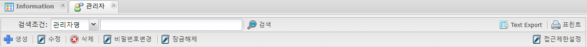
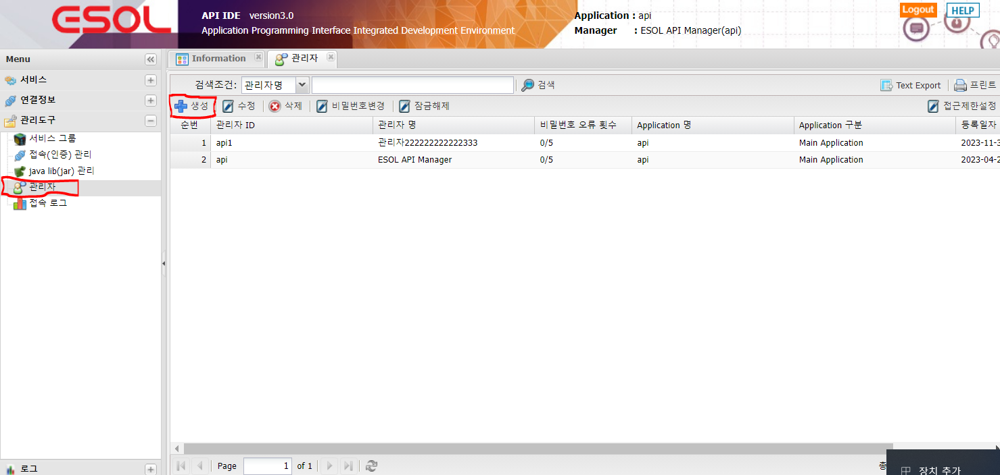
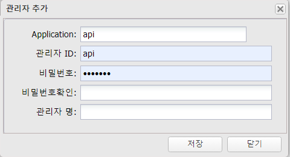
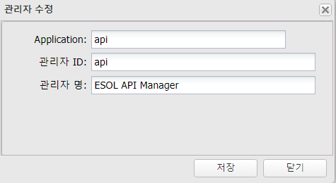
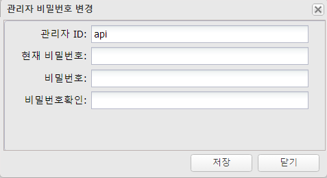
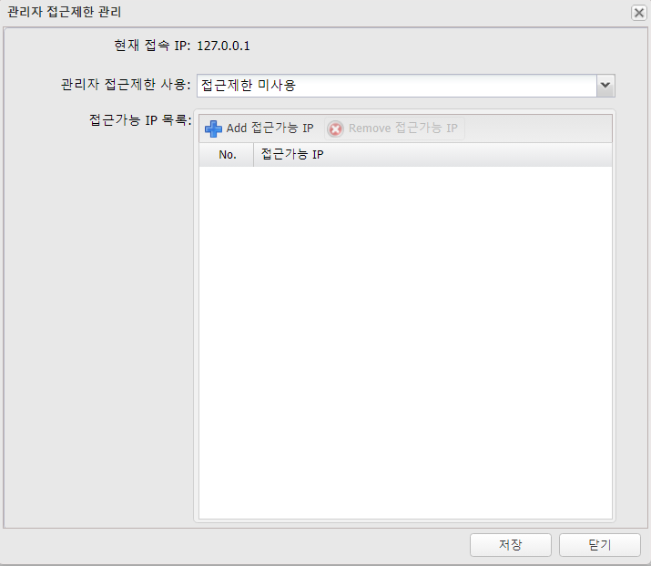

# 관리자

---

## 1. 관리자
### 1.1. 정의

>ESOL 서비스 생성 관리자 생성  

### 1.2. 주요기능 및 부가기능
 </img>
| 기능 | 설명 |  
|:--:|:--|  
| 검색  | 서비스 검색 기능 :  검색조건은 관리자ID ,  관리자명으로 검색 |
| Text Export  | 조회된 화면(목록)을 Text 로 Export |
| 프린트  | 조회된 화면(목록) 인쇄 |
| 생성  | 관리자 생성 |
| 수정  | 조회된 화면(목록)에서 선택된 관리자 수정 |
| 삭제  | 조회된 화면(목록)에서 선택된 관리자 삭제 |
| 비밀번호변경  | 관리자의 비밀번호 변경 |
| 잠금해제  | 비밀번호 5회이상 오류로 잠금상태  관리자의 잠금해제 기능 |
| 접근제한설정  | 전체 관리자를 IP별로 접근을 제한하는 기능 |

## 2. 사용법
### 2.1. 관리자 생성

🎈 __Menu > 관리도구 > 관리자 > 생성__

 </img>

#### 2.1.1 속성

 </img>

| 입력값 | 설명 |
|:--:|:--|
| Application | 시스템의 Application ID 고정값  |
| 관리자 ID | 관리자 ID, 최대 25자리 영문, 숫자, _ |
| 비밀번호 | 비밀번호, 문자, 숫자, 특수문자의 조합으로 8~20자리 |
| 비밀번호 확인 | 비밀번호 확인 |
| 관리자 명 | 관리자명, 최대 50자 |

### 2.2. 관리자 수정

🎈 __Menu > 관리도구 > 관리자 > 수정__

#### 2.2.1 속성

 </img>

| 입력값 | 설명 |
|:--:|:--|
| Application | 시스템의 Application ID 고정값  |
| 관리자 ID | 관리자 ID ReadOnly |
| 관리자 명 | 관리자명, 최대 50자 |

### 2.3. 관리자 비밀번호변경

🎈 __Menu > 관리도구 > 관리자 > 비밀번호변경__

#### 2.3.1 속성

 </img>

| 입력값 | 설명 |
|:--:|:--|
| 관리자 ID | 관리자 ID ReadOnly |
| 현재 비밀번호 | 관리자 현재 비밀번호 |
| 비밀번호 | 비밀번호, 문자, 숫자, 특수문자의 조합으로 8~20자리 |
| 비밀번호 확인 | 비밀번호 확인 |
 
### 2.4. 접근제한설정

🎈 __Menu > 관리도구 > 관리자 > 접근제한설정__

#### 2.4.1 속성

 </img>

| 입력값 | 설명 |
|:--:|:--|
| 현재 접속 IP | 서버쪽에 연결된 Remote IP |
| 관리자 접근제한 사용 | '접근제한 사용' , '접근제한 미사용' |
| 접근가능 IP 목록 | IP 입력 , IP 대역( \* ) 으로 입력도 가능 단 A class 이상 ( 127.\*.\*.\* , 127.0.\*.\*)   운영 시스템에 적용시에는 내부 IP대역으로 접근 제한을 권장 합니다.|