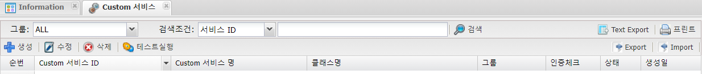
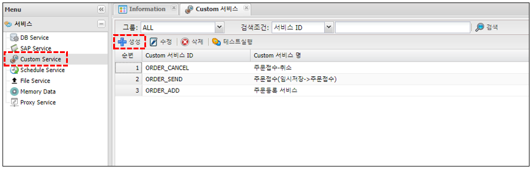
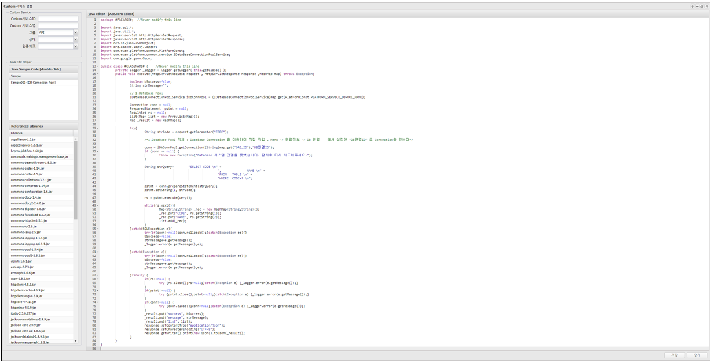
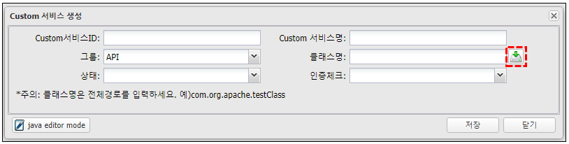
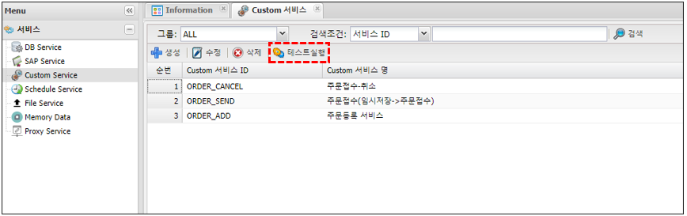
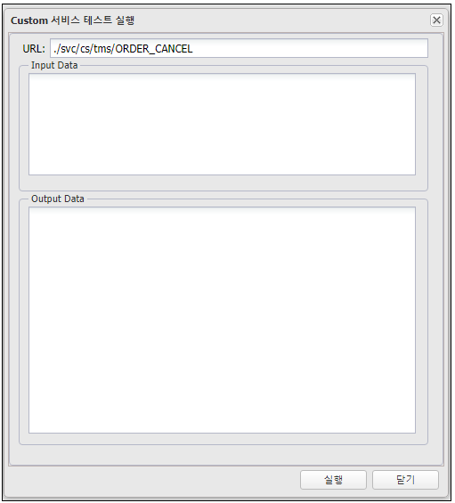

# Custom Service

---

## 1. Custom Service 란
### 1.1. 정의
 >DB 서비스만으로 처리가 불가능한 기능들에 대해 직접 java 코딩하여 로직을 구현한 서비스 호출을 할 수 있는 서비스,  
 >application 환경설정 파일의 설정에 따라 웹에서 코딩을 하여 사용하거나, 직접 업로드하여 사용
 
  
>직접 업로드 시 class 파일의 경로는 보통 './project/WEB-INF/classes' (변경 가능)

> Custom Serivce는 사용을 권장하지 않습니다.

### 1.2. 주요기능 및 부가기능
 </img>
| 기능 | 설명 |  
|:--:|:--|  
| 검색  | 서비스 검색 기능 :  그룹별 ,검색조건은 서비스ID ,<br/> 서비스명으로 검색|
| Text Export  | 조회된 화면(목록)을 Text 로 Export |
| 프린트  | 조회된 화면(목록) 인쇄 |
| 생성  | 서비스 생성 |
| 수정  | 조회된 화면(목록)에서 선택된 서비스 수정 |
| 삭제  | 조회된 화면(목록)에서 선택된 서비스 삭제 |
| 테스트실행  | 서비스 실행 (Timeout:120초) |
| Export  | 서비스 전체를 Export 한다. 파일로 다운받는다.<BR/>백업용으로 활용하거나 서비스 이관작업에 사용한다. |
| Import  | Export된 파일을 Import한다.<BR/>서비스 복구에 사용하거나 서비스 이관작업에 사용한다. |

## 2. 사용법

### 2.1. 생성

🎈 __menu > 서비스 > Custom Service > 생성__

 </img>

#### 2.1.1. 웹 코딩

🎈 __menu > 서비스 > Custom Service > 생성 > 하단 java editor mode__

 </img>

##### 2.1.1.1. 속성
| 구분 | 설명 |
|:--:|:--|
| Custom 서비스 ID | 고유한 ID(중복 불가, 영어, 숫자, underscore('_') 5자 이상 50자 이내 <br/>{host}/svc/cs/{application id}/{서비스ID} 로 호출되어지는 서비스로 생성 |
| Custom 서비스명 | 이름, 혹은 설명입력, 작업자가 구분하기 위해 사용 |
| 그룹 | 작업자가 구분하기 위해 사용 |
| 상태 | 서비스 사용 상태 구분, 활성 / 비활성 선택하여 사용 선택가능 |
| 인증체크 | 발급된 Token을 사용하여 서비스 사용시 인증 체크 사용 여부 |

##### 2.1.1.2. Java Edit Helper
| 구분 | 설명 |
|:--:|:--|
| Java Sample Code | sample 목록 중 선택하면 해당 항목의 견본이 우축 Java editor에 입력 |
| Referenced Libraries | 사용가능한 library 목록 |

##### 2.1.1.3. java editor
`package #PACKAGE#;`, 
`public class #CLASSNAME#`  

❗ __이부분은 절대 지우거나 변경하시면 안됩니다.__


#### 2.1.2. class 파일 직접 업로드
##### 2.1.2.1. 속성

 </img>

| 구분 | 설명 |
|:--:|:--|
| Custom 서비스 ID | 고유한 ID(중복 불가, 영어 숫자 underscore('_') 5자 이상 50자 이내<br/>{host}/svc/cs/{application id}/{서비스ID} 로 호출되어지는 서비스로 생성된다 |
| Custom 서비스명 | 이름, 혹은 설명입력, 작업자가 구분하기 위해 사용 |
| 그룹 | 작업자가 구분하기 위해 사용 |
| 클래스명 | 사용될 클래스의 패키지명을 포함한 클래스 이름 예) test.package.ClassName |
| 상태 | 서비스 사용 상태 구분, 활성 / 비활성 선택하여 사용 선택가능 |
| 인증체크 | 발급된 Token을 사용하여 서비스 사용시 인증 체크 사용 여부 |
| 파일 업로드 버튼</br>(붉은색 테두리 버튼) | class파일 업로드 버튼 |


### 2.2. 테스트

🎈 __생성된 Custom Service Item 선택 > 테스트실행__

 </img>

__테스트 결과__
> HttpServletRequest.getParameterMap() 을 사용하여 parameter list를 tree map으로 받아 출력하는 예제
> 출력은 작성된 로직에따라 다름.

 </img>

---
## 3. Custom JAVA
### 3.1. 기본 구조

>HttpServletRequest, HttpServletResponse, HashMap 인자값을 가진 execute 메소드 필요

```java
public class SampleCustom {
    public void execute(HttpServletRequest request, HttpServletResponse response, HashMap map) {
        ...
    }
}
```

### 3.2. DB Connection 을 얻는 방법

```java
생성된 DB 연결 ID 를 이용해 Connection을 직접 얻어오는 방법

import com.evan.platform.common.PlatFormConst;
import com.evan.platform.common.service.IDataBaseConnectionPoolService;

...

public class GetDBConnection {

    public void execute(HttpServletRequest request, HttpServletResponse response, HashMap map) {

        // DataBase Pool 객체
        IDataBaseConnectionPoolService iDataBaseConnectionPoolService = 
            (IDataBaseConnectionPoolService)map.get(PlatFormConst.PLATFORM_SERVICE_DBPOOL_NAME);

        Connection conn = null;

        try {
            // DB연결ID는 platform 관리자 화면에서 연결정보 -> DB연결 메뉴에서 만들어둔 DB연결ID 입력
            conn = iDataBaseConnectionPoolService.getConnection((String)map.get("ORG_ID"),"DB연결ID");
            if (conn == null) {
                throw new Exception("Database 시스템 연결을 못했습니다. 잠시후 다시 시도해주세요.");
            }
        } catch (Exception e) {
            e.printStackTrace();
        }
    }
}
```

### 3.3. DB Service 사용방법

```java
생성된 DB Service를 사용하는 방법

import com.evan.platform.common.PlatFormConst;
import com.evan.platform.common.service.IExecDataBaseService;

...

public class UsingDBService {

    public void execute(HttpServletRequest request, HttpServletResponse response, HashMap map) {

        // DB Service 실행 객체
        IExecDataBaseService iExecDataBaseService = 
            (IExecDataBaseService)map.get(PlatFormConst.PLATFORM_SERVICE_EXEDB_NAME);

        try {
            // DB Service 테스트 실행시 사용하는 문법확인 필요
            JSONObject inJson=JSONObject.fromObject("json");
            JSONObject outJson = iExecDataBaseService.getDataBaseService((String)map.get("ORG_ID"),"DB Service ID", inJson, request);
            if(outJson.getBoolean("success")) {
                //outJson 정보를 사용하여 작업
            }
        } catch (Exception e) {
            e.printStackTrace();
        }
    }
}
```

### 3.4. SAP Service 사용방법

```java
생성된 SAP Service를 사용하는 방법

public class UsingSapService {

    public void execute(HttpServletRequest request, HttpServletResponse response, HashMap map) {

        // Sap Service 실행 객체
        IExecSapService iExecSapService = 
            (IExecSapService)map.get(PlatFormConst.PLATFORM_SERVICE_EXESAP_NAME);

        try {
            // SAP Service 테스트 실행시 사용하는 문법확인 필요
            JSONObject inJson = JSONObject.fromObject(
                "{\"input\": {\"IMPORT_PARAMETER\": {\"I_TYPE\": \"0\"},\"TABLE\": {\"I_VBELN\": {\"item\": [{}]}}}}"
            );  
            JSONObject outJson = iExecSapService.getSapService((String)map.get("ORG_ID"),"SAP Service ID", inJson);
            if(outJson.getBoolean("success")) {
                //outJson 정보를 사용하여 작업
            }
        } catch (Exception e) {
            e.printStackTrace();
        }
    }
}
```
