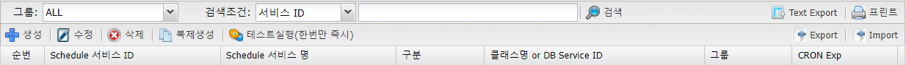
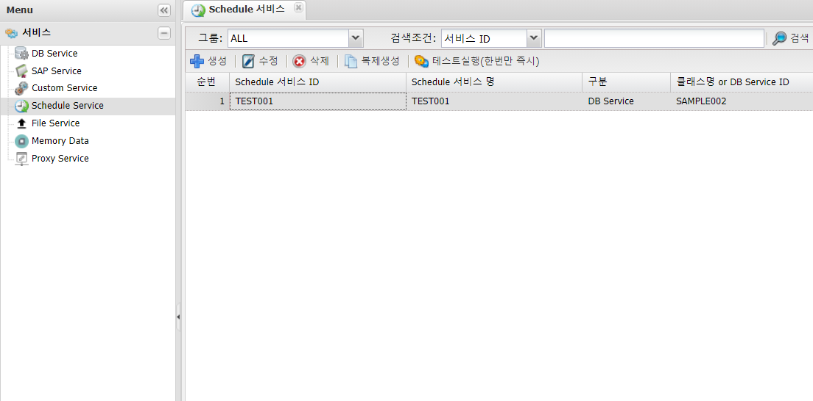
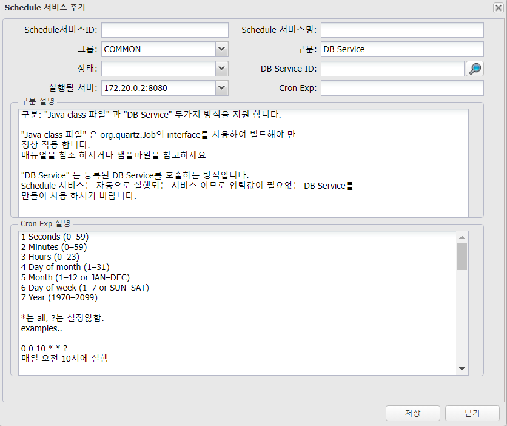
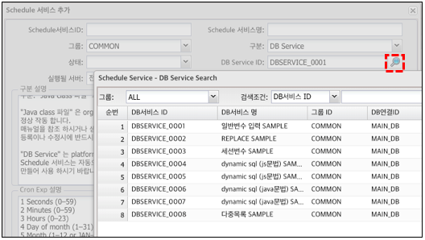

# Schedule Service

---
## 1. Schedule Service 란
### 1.1. 정의

>등록된 DB 서비스, Custom 서비스를 특정시간, 반복 실행이 필요할때 사용


>즉시 실행을 해야 하는 경우 혹은 개발테스트가 필요할 경우는 상단의 "테스트실행(한번만 즉시)" 를 실행한다.
>
>상태가 비활성만 테스트실행 가능, 대상서버와 상관없이 해당서버만 한번 바로 실행이 가능
### 1.2. 주요기능 및 부가기능
 </img>
| 기능 | 설명 |  
|:--:|:--|  
| 검색  | 서비스 검색 기능 :  그룹별 ,검색조건은 서비스ID ,<br/> 서비스명으로 검색|
| Text Export  | 조회된 화면(목록)을 Text 로 Export |
| 프린트  | 조회된 화면(목록) 인쇄 |
| 생성  | 서비스 생성 |
| 수정  | 조회된 화면(목록)에서 선택된 서비스 수정 |
| 삭제  | 조회된 화면(목록)에서 선택된 서비스 삭제 |
| 복제생성  | 조회된 화면(목록)에서 선택된 서비스를 복제생성<BR/>서비스ID만 입력하여 동일한 서비스를 생성 |
| 테스트실행<BR/>(한번만 즉시)  | 스케줄 서비스를 한번만 실행시킨다.<BR/> 단. 상태가 '비활성' 만 테스트 실행 가능  |
| Export  | 서비스 전체를 Export 한다. 파일로 다운받는다.<BR/>백업용으로 활용하거나 서비스 이관작업에 사용한다. |
| Import  | Export된 파일을 Import한다.<BR/>서비스 복구에 사용하거나 서비스 이관작업에 사용한다. |

## 2. 사용법
### 2.1. 생성

🎈 __menu > 서비스 > Schedule Service > 생성__

 </img>

### 2.2. 속성

 </img>

| 구분 | 설명 |
|:--:|:--|
| Schedule 서비스 ID | 고유한 ID(중복 불가, 영어, 숫자, underscore('_') 5자 이상 50자 이내 |
| Schedule 서비스명 | 이름, 혹은 설명입력, 작업자가 구분하기 위해 사용 |
| 그룹 | 작업자가 구분하기 위해 사용 |
| 구분 | DB Service or java class |
| 상태 | 서비스 사용 상태 구분, 활성 / 비활성 선택하여 사용 선택가능 |
| DB Service ID or<br/> 클래스명 | DB Service ID or Java class 파일 일때 실행될 클래스파일 지정 | 
| 실행될 서버 | 만들어질 서비스가 실행될 서버 지정 |
| Cron Exp | 실행 주기 설정 |


#### 2.2.1. DB Service ID (권장)

 </img>

- __DB Service ID 선택 시__
	- "DB Service" 는 등록된 DB Service를 호출하는 방식  
	- Schedule 서비스는 자동으로 실행되는 서비스 이므로 입력값이 필요없는 DB Service를 만들어 사용


#### 2.2.2. JAVA class 파일 (권장 하지 않음)
- __구분 - JAVA class 파일 선택 시__
	- "Java class 파일" 은 org.quartz.Job의 interface를 사용하여 빌드해야 만 정상 작동  
	- 매뉴얼 참조 및  샘플파일 참고  
	- 등록이나 수정시에 반드시 class 파일이 내부에 먼저 존재 해야 가능

```java
Schedule 서비스에 등록될 JAVA 기본 구조

...

import org.quartz.JobDataMap;
import org.quartz.JobDetail;
import org.quartz.JobExecutionContext;
import org.quartz.StatefulJob;

...

public class CronSample implements StatefulJob {
    public void execute(JobExecutionContext context) {
        ...
    }
}
```


---
## 3. 별첨
### 3.1. Cron exp

```
1 Seconds (0–59)
2 Minutes (0–59)
3 Hours (0–23)
4 Day of month (1–31)
5 Month (1–12 or JAN–DEC)
6 Day of week (1–7 or SUN–SAT)
7 Year (1970–2099)

*는 all, ?는 설정않함.
examples..

0 0 10 * * ?
매일 오전 10시에 실행

0 0 10 1 * ?
매월 1일 오전 10시에 실행

0/5 * * * * ?
5초마다 실행

필드 허용범위 허용문자
초 0-59 , – * / 
분 0-59 , – * / 
시 0-23 , – * / 
일 1-31 , – * ? / L W
월 1-12 or JAN-DEC , – * / 
요일 1-7 or SUN-SAT , – * ? / L # 
년(옵션) 1970-2099 , – * /

* 모든 값
? 특정 값 없음
- 범위 지정에 사용
, 여러 값 지정 구분에 사용
/ 초기값과 증가치 설정에 사용
L 지정할 수 있는 범위의 마지막 값
W 월~금요일 또는 가장 가까운 월/금요일
# 몇 번째 무슨 요일 2#1 => 첫 번째 월요일

예제) 
Expression Meaning 
초분시일월주(년)
“0 0 12 * * ?” 아무 요일, 매월, 매일 12:00:00
“0 15 10 ? * *” 모든 요일, 매월, 아무 날이나 10:15:00 
“0 15 10 * * ?” 아무 요일, 매월, 매일 10:15:00 
“0 15 10 * * ? *” 모든 연도, 아무 요일, 매월, 매일 10:15 
“0 15 10 * * ? 2005″ 2005년 아무 요일이나 매월, 매일 10:15 
“0 * 14 * * ?” 아무 요일, 매월, 매일, 14시 매분 0초 
“0 0/5 14 * * ?” 아무 요일, 매월, 매일, 14시 매 5분마다 0초 
“0 0/5 14,18 * * ?” 아무 요일, 매월, 매일, 14시, 18시 매 5분마다 0초 
“0 0-5 14 * * ?” 아무 요일, 매월, 매일, 14:00 부터 매 14:05까지 매 분 0초 
“0 10,44 14 ? 3 WED” 3월의 매 주 수요일, 아무 날짜나 14:10:00, 14:44:00 
“0 15 10 ? * MON-FRI” 월~금, 매월, 아무 날이나 10:15:00 
“0 15 10 15 * ?” 아무 요일, 매월 15일 10:15:00 
“0 15 10 L * ?” 아무 요일, 매월 마지막 날 10:15:00 
“0 15 10 ? * 6L” 매월 마지막 금요일 아무 날이나 10:15:00 
“0 15 10 ? * 6L 2002-2005″
2002년부터 2005년까지 매월 마지막 금요일 아무 날이나 10:15:00 
“0 15 10 ? * 6#3″ 매월 3번째 금요일 아무 날이나 10:15:00

“?”는 4번째 Day of month (1–31) 와 6번째 Day of week (1–7 or SUN–SAT) 만 사용 가능 합니다. 
“?”와 “*”의 차이를 구분하기가 어렵습니다. 
```
